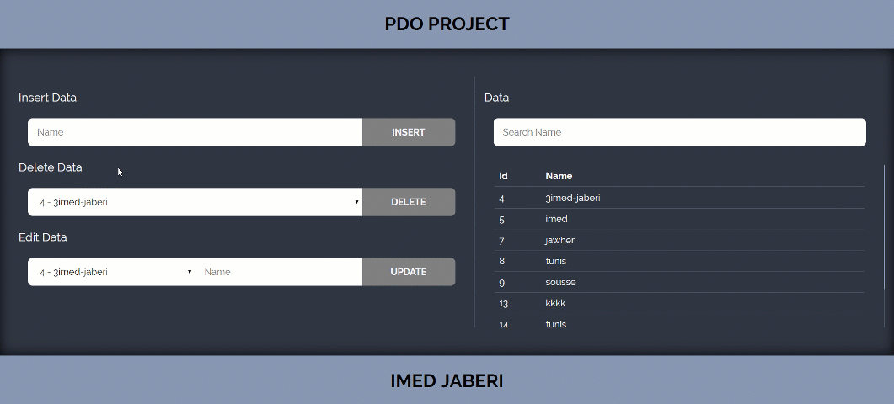

# PDO-PROJECT
---
## What technologies that i used ?
 - Apache 2.4.35
 - Php 7.2.10
 - mySQL 8.0.12

## Setup prerequists
 - you have to install dev-server like XAMPP , EASYPHP , WAMP or clone my [dev-server](https://github.com/3imed-jaberi/dev-server) .. 

## How to run the application
 - Clone this project.
 - Put this project in WORKSPACES folder of the dev-server. 
 - Open browser then enter with localhost to project folder.
 
## Demo 

  
#### License
---
[MIT](https://choosealicense.com/licenses/mit/)  

